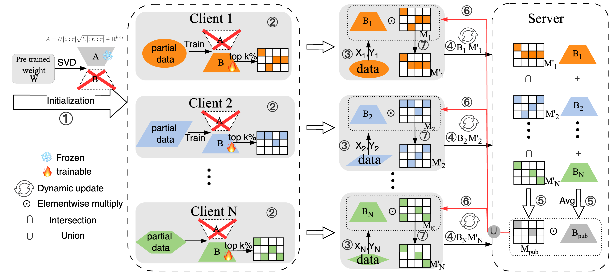

# FedDynMask
FedDynMask: Efficient Federated Fine-Tuning for Edge LLMs via Dynamic Sparse Masking [INFOCOM 2026].

Fig. 1. Federated Dynamic Masking framework.

## Installation

Our code is based on Python version 3.10 and PyTorch version 2.1.0. 
You can install all the dependencies with the following command:
```shell
conda create -n feddynmsak python=3.10
conda activate feddynmsak
conda install pytorch==2.1.0 torchvision==0.16.0 torchaudio==2.1.0 pytorch-cuda=12.1 -c pytorch -c nvidia
pip install -e .[llm]


## Training

Now, we can fine-tune a LLM with FedDynMask:

```shell
python federatedscope/main.py --cfg federatedscope/llm/yamls/test.yaml
```

## Acknowledgement

We would like to thank the authors for releasing the public repository: [FederatedScope-LLM](https://github.com/alibaba/FederatedScope/tree/llm).
